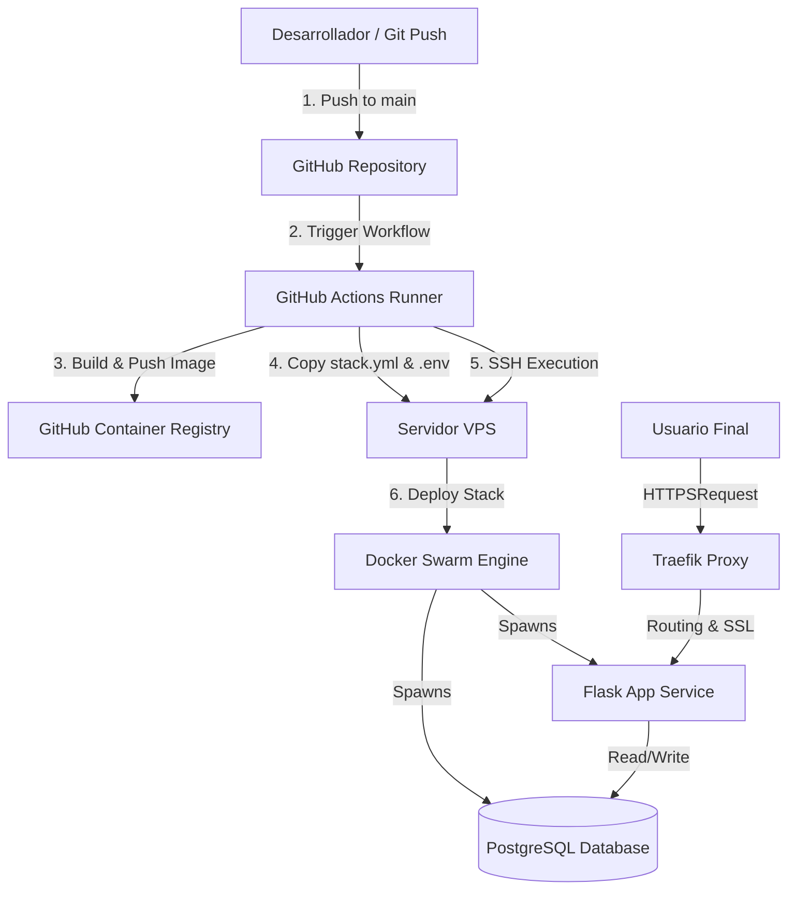

# Habilidad: Demostración de Despliegue en Vivo con Docker Swarm + Flask + Traefik

Esta habilidad proporciona una guía detallada y estructurada para replicar el despliegue automático del proyecto en un entorno de producción (VPS) utilizando Docker Swarm, Traefik como Proxy Reverso con SSL automático y GitHub Actions como pipeline de CI/CD.

Es ideal para charlas en vivo, demostraciones o para recrear la infraestructura desde cero.

---

## 🛠️ Arquitectura de la Solución



---

## 📋 Requisitos Previos

### 1. Servidor VPS (Ubuntu/Debian)
- Acceso SSH configurado.
- Docker instalado.
- Inicializar el modo Swarm:
  ```bash
  docker swarm init --advertise-addr <IP_PUBLICA_VPS>
  ```

### 2. Configuración de Traefik (Proxy Global)
Para que las etiquetas de Traefik en `stack.yml` funcionen, Traefik debe estar corriendo en el Swarm bajo la red pública externa `traefik-public`.
1. Crear la red externa en el VPS:
   ```bash
   docker network create --driver=overlay --attachable traefik-public
   ```
2. Desplegar Traefik (si no está iniciado). Un stack básico de Traefik con soporte Let's Encrypt es necesario para resolver los certificados SSL dinámicamente.

### 3. Registro de Contenedores (GHCR)
- Un Personal Access Token (PAT) de GitHub con permisos de lectura y escritura de paquetes (`write:packages`, `read:packages`).

---

## 🚀 Paso a Paso de la Demo en Vivo

### Paso 1: Configurar el Repositorio Local
Para recrear la aplicación Flask minimalista, puedes usar la plantilla de ejemplo de esta habilidad:
1. Copiar [app_simple.py.example](file:///d:/Docker/demo_ia/.agents/skills/live-swarm-deployment-demo/examples/app_simple.py.example) como `app.py`.
2. Copiar [requirements.txt.example](file:///d:/Docker/demo_ia/.agents/skills/live-swarm-deployment-demo/examples/requirements.txt.example) como `requirements.txt`.
3. Copiar [config.py.example](file:///d:/Docker/demo_ia/.agents/skills/live-swarm-deployment-demo/examples/config.py.example) como `config.py`.

### Paso 2: Crear el Dockerfile
La dockerización optimizada (python-slim) y lista para producción utiliza un servidor WSGI como Gunicorn.
1. Copiar [Dockerfile.example](file:///d:/Docker/demo_ia/.agents/skills/live-swarm-deployment-demo/examples/Dockerfile.example) como `Dockerfile`.
2. Explicar durante la presentación:
   - Uso de `python:3.12-slim` para reducir el tamaño de la imagen.
   - Instalación de librerías nativas necesarias para PostgreSQL (`libpq-dev`, `gcc`).
   - Copia selectiva de dependencias para aprovechar la caché de Docker.
   - Ejecución mediante Gunicorn para manejar hilos y concurrencia.

### Paso 3: Configurar Orquestación con Docker Swarm
El archivo `stack.yml` define los servicios de la aplicación (Flask) y la base de datos (PostgreSQL), además de integrarse con el proxy de Traefik.
1. Copiar [stack.yml.example](file:///d:/Docker/demo_ia/.agents/skills/live-swarm-deployment-demo/examples/stack.yml.example) como `stack.yml`.
2. Puntos clave a destacar en la charla:
   - **Replicas:** Permite escalar dinámicamente la aplicación.
   - **Rollback Config:** Configuración de despliegues progresivos `order: start-first` para evitar caídas de servicio (Zero Downtime).
   - **Etiquetas de Traefik (Labels):** Configuran el enrutamiento HTTP, la redirección automática a HTTPS y la resolución automática de certificados SSL de Let's Encrypt.
   - **Volumen Persistente:** El volumen `pgdata` garantiza que los datos de PostgreSQL no se pierdan al reiniciar contenedores.
   - **Redes Separadas:** Red interna `db-network` (para comunicación web-db aislada) y red externa `traefik-public`.

> [!WARNING]
> Recuerda cambiar la regla de Host `Host(\`practica.byronrm.com\`)` por tu dominio o subdominio real apuntado a la IP del VPS.

### Paso 4: Automatización CI/CD con GitHub Actions
El flujo compila la imagen, la sube a GitHub Container Registry (GHCR) y luego descarga/despliega los cambios en el VPS de forma remota.
1. Crear el directorio `.github/workflows/`.
2. Copiar [deploy.yml.example](file:///d:/Docker/demo_ia/.agents/skills/live-swarm-deployment-demo/examples/deploy.yml.example) como `.github/workflows/deploy.yml`.

### Paso 5: Configurar GitHub Secrets
Antes de subir los cambios a GitHub, se deben registrar las siguientes variables secretas en `Settings -> Secrets and variables -> Actions`:

| Nombre del Secret | Descripción / Ejemplo |
| :--- | :--- |
| `GHCR_PATH` | Tu Personal Access Token (PAT) de GitHub con accesos de paquetes. |
| `SECRET_KEY` | Llave secreta aleatoria para Flask. |
| `POSTGRES_USER` | Usuario de la BD de producción (ej. `dbuser`). |
| `POSTGRES_PASSWORD` | Contraseña segura para PostgreSQL. |
| `POSTGRES_DB` | Nombre de la base de datos (ej. `dbname`). |
| `POSTGRES_HOST` | Host de la base de datos en el stack (usar `db`). |
| `VPS_HOST` | Dirección IP pública del servidor VPS. |
| `VPS_USER` | Usuario del VPS para acceso SSH (ej. `ubuntu` o `root`). |
| `VPS_SSH_KEY` | Clave privada SSH o contraseña de acceso del usuario del VPS. |
| `VPS_SSH_PORT` | Puerto de conexión SSH (comúnmente `22`). |

---

## 💻 Ejecución en Vivo: Comandos del Presentador

### Local (Laptop)
Para lanzar el despliegue automático, simplemente realiza un push a la rama principal:
```bash
git add .
git commit -m "feat: live demo setup"
git push origin main
```

### Remoto (VPS)
Durante la demostración, conéctate al VPS para mostrar cómo se gestiona y actualiza la infraestructura en tiempo real:

1. **Monitorear el estado de los servicios:**
   ```bash
   docker service ls
   ```
2. **Inspeccionar los contenedores corriendo en el servicio Flask:**
   ```bash
   docker service ps practica_practica
   ```
3. **Ver logs en tiempo real para demostrar el tráfico y conexión a BD:**
   ```bash
   docker service logs -f practica_practica
   ```
4. **Verificar que la base de datos persistente está funcionando:**
   Accede a la URL configurada, refresca el sitio web para ver incrementar el contador y explica cómo los contenedores pueden destruirse y recrearse sin perder el contador gracias al volumen Docker `pgdata`.

---

## 🔍 Solución de Problemas Frecuentes

### 1. Error de SSL en Traefik
Si el dominio muestra un error de certificado no válido:
- Verifica que el subdominio apunte correctamente (DNS de tipo A) a la IP pública del VPS.
- Revisa los logs de Traefik para confirmar si Let's Encrypt ha alcanzado los límites de rate limit o si hay un problema de red.

### 2. Error `Error response from daemon: network traefik-public not found`
- Ocurre si la red externa no ha sido creada en el VPS antes de desplegar. Ejecuta:
  `docker network create --driver=overlay --attachable traefik-public`.

### 3. Problema al descargar la imagen de GHCR en el VPS
- El comando `docker login ghcr.io` puede fallar si el token `GHCR_PATH` expiró o no tiene permisos de lectura de paquetes (`read:packages`).
